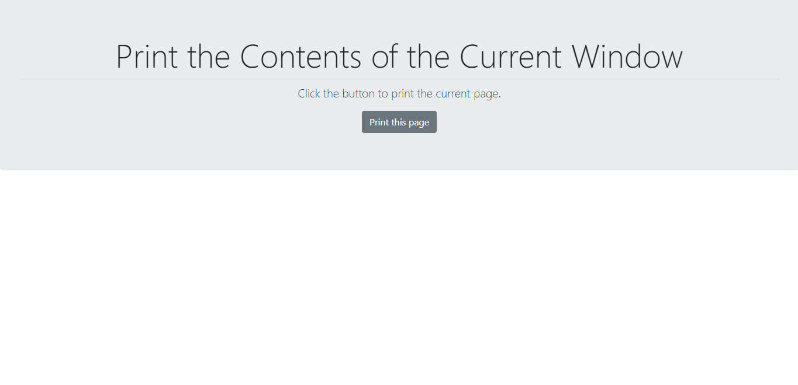

# Print the contents of the Current Window
 A JavaScript function to print the contents of the current window.
## Installation
- All the `code` required to get started.
## Clone
- Clone this repo to your local machine using `https://github.com/Hanyraaj/print-the-contents-of-the-current-window`
## Screenshot

